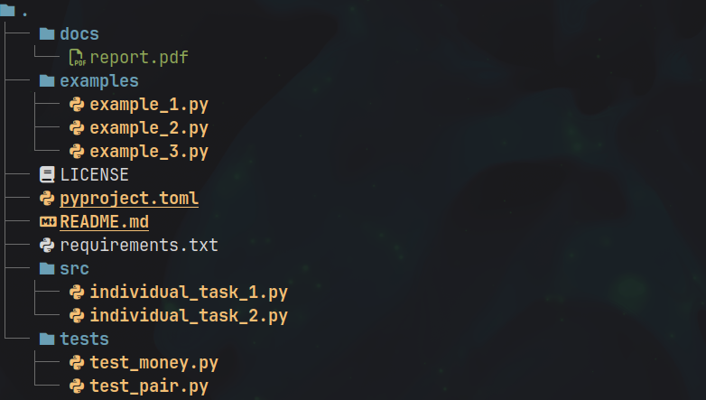

# Лабораторная работа №3 (4.2)
**Предмет** Объектно-ориентированное программирование  
**Тема:** Перегрузка операторов в языке Python  
**Вариант:** 8  

## Содержание

1. [Описание работы](#цель-работы)  
2. [Ссылка на отчет](#ссылка-на-отчет)  
3. [Структура репозитория](#структура-репозитория)  
4. [Задания](#задания)  

---

## Цель работы

Приобретение навыков по перегрузке операторов при написании программ с помощью языка программирования Python версии 3.x.

---

## Ссылка на отчет

[Отчет о выполнении лабораторной работы](docs/report.pdf)

---

## Структура репозитория

- `docs/` — отчет по лабораторной работе
- `examples/` — примеры из лабораторной работы  
- `src/` — исходный код программы
- `tests/` — pytests
- `pyproject.toml` - конфигурация проекта
- `requirements.txt` — список зависимостей

---

## Задания

### Индивидуальное задание №1
[Исходный код задания](src/individual_task_1.py)

Выполнить индивидуальное задание 1 [лабораторной работы 4.1](https://github.com/m4g0med0v/OOP_LR_1), максимально задействовав
имеющиеся в Python средства перегрузки операторов.

### Индивидуальное задание №2
[Исходный код задания](src/individual_task_2.py)

Дополнительно к требуемым в заданиях операциям перегрузить операцию индексирования [].
Максимально возможный размер списка задать константой. В отдельном поле size должно
храниться максимальное для данного объекта количество элементов списка; реализовать метод
size(), возвращающий установленную длину. Если количество элементов списка изменяется во
время работы, определить в классе поле count. Первоначальные значения size и count
устанавливаются конструктором. В тех задачах, где возможно, реализовать конструктор инициализации строкой.

Реализовать класс Money, используя для представления суммы денег список словарей.
Словарь имеет два ключа: номинал купюры и количество купюр данного достоинства.
Номиналы представить как строку. Элемент списка словарей с меньшим индексом
содержит меньший номинал.
